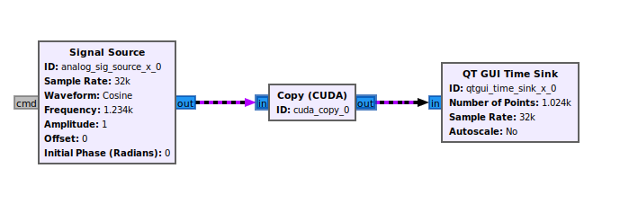

# gr-cuda

CUDA Support for GNU Radio using the custom buffer changes introduced in GR 3.10.  Custom buffers for CUDA-enabled hardware are provided that can be included in any OOT.  This allows the work() or general_work() function of a block to have data provided in the input- and output- buffers that has already been transitioned to device memory so that data movement does not have to take place in the work() function itself.  



## Acknowledgement

This OOT is adapted/copied from the gr-cuda_buffer OOT work by Black Lynx, Inc. (https://github.com/BlackLynx-Inc/gr-cuda_buffer) and relies on the custom buffer feature developed by David Sorber and documented here:
https://wiki.gnuradio.org/index.php/CustomBuffers

## Prerequisites

1. NVIDIA CUDA supported GPU
2. Installation of CUDA
3. GNU Radio >= 3.10.0.0

## Usage

This OOT can be included in your OOT as follows

### ./CMakeLists.txt
```cmake
project(gr-myoot CXX C CUDA)
```

### ./lib/CMakeLists.txt

1. Find the exported CMake from gr-cuda as follows
```cmake
find_package(gnuradio-cuda REQUIRED)
```

2. Create a library to hold the CUDA specific code:

```cuda
add_library(gnuradio-myoot-cu STATIC 
    my_kernel.cu
)
set_target_properties(gnuradio-myoot-cu PROPERTIES 
    POSITION_INDEPENDENT_CODE ON
    CUDA_VISIBILITY_PRESET "hidden"
    CUDA_SEPARABLE_COMPILATION ON
)

# Make a fat binary for supported architectures
# Compile for supported archs; CMake workaround, see: https://stackoverflow.com/a/54505975/73878
target_compile_options(gnuradio-myoot-cu PRIVATE "$<$<COMPILE_LANGUAGE:CUDA>:SHELL:-gencode arch=compute_60,code=sm_60>")
target_compile_options(gnuradio-myoot-cu PRIVATE "$<$<COMPILE_LANGUAGE:CUDA>:SHELL:-gencode arch=compute_61,code=sm_61>")
target_compile_options(gnuradio-myoot-cu PRIVATE "$<$<COMPILE_LANGUAGE:CUDA>:SHELL:-gencode arch=compute_62,code=sm_62>")
target_compile_options(gnuradio-myoot-cu PRIVATE "$<$<COMPILE_LANGUAGE:CUDA>:SHELL:-gencode arch=compute_70,code=sm_70>")
target_compile_options(gnuradio-myoot-cu PRIVATE "$<$<COMPILE_LANGUAGE:CUDA>:SHELL:-gencode arch=compute_72,code=sm_72>")
target_compile_options(gnuradio-myoot-cu PRIVATE "$<$<COMPILE_LANGUAGE:CUDA>:SHELL:-gencode arch=compute_75,code=sm_75>")
# target_compile_options(gnuradio-myoot-cu PRIVATE "$<$<COMPILE_LANGUAGE:CUDA>:SHELL:-gencode arch=compute_80,code=sm_80>")
# target_compile_options(gnuradio-myoot-cu PRIVATE "$<$<COMPILE_LANGUAGE:CUDA>:SHELL:-gencode arch=compute_86,code=sm_86>")
```

3. Link to gr-cuda 

The `target_link_libraries` statement should be changed to specify public linkage
```cmake
target_link_libraries(gnuradio-myoot PUBLIC gnuradio::gnuradio-runtime gnuradio-cuda)
```

4. Link to the custom CUDA code
```cmake
target_link_libraries(gnuradio-myoot PRIVATE gnuradio-myoot-cu)
```

## Creating a Block in an OOT with CUDA acceleration

1. Create a `.cu` file that will hold the CUDA kernel and wrapper and be compiled with `nvcc` and linked to the block

See `multiply_const.cu` for an example

2. Use `gr_modtool` to create a block in your OOT

See `multiply_const.h`, `multiply_const_impl.{cc,h}`

3. Set the io_signature to specify the custom buffer

3. Call the kernel wrapper inside the `work()` function

